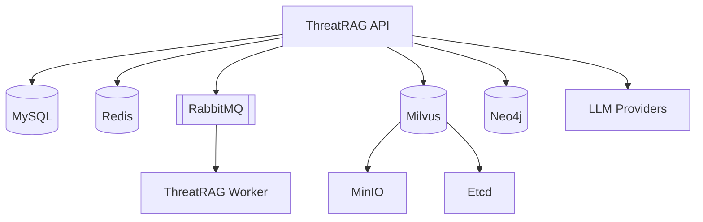

# ThreatRAG Docker Deployment Guide

This document describes how to deploy the ThreatRAG system using Docker Compose.

## Architecture Diagram



## Quick Start

### 1. Clone the Project
```bash
git clone https://github.com/djmahe4/CTI-RAG.git
cd CTI-RAG
```

### 2. One-Click Start
Use Docker Compose to build and start all services:
```bash
# Build and start
docker compose up -d --build

# Restart all services
docker compose restart
```

### 3. Create Environment Configuration
Copy the template and edit your `.env` file:
```bash
cp .env.example .env
# Edit .env with your API keys and credentials
```

### 4. Initialization
The system automatically runs initialization scripts on first start. To manually trigger:
```bash
# Check service status
docker compose ps

# Run manual initialization (usually not required)
docker compose exec threatrag python scripts/init_db.py
```

## Service Monitoring

### View Logs
```bash
# View all service logs
docker compose logs -f

# View specific service logs
docker compose logs -f threatrag
```

### Execute Commands in Container
```bash
# Enter API container
docker compose exec threatrag bash

# Enter MySQL container
docker compose exec mysql mysql -u root -p
```

## Advanced Configuration

### Resource Optimization
You can adjust resource limits in `docker-compose.yml` for high-performance deployments.

### Custom Ports
If default ports are occupied, modify the mapping in `docker-compose.yml`:
```yaml
ports:
  - "8080:8000" # Change host port from 8000 to 8080
```

## Maintenance

### Stop Services
```bash
# Graceful stop
docker compose stop

# Stop and remove containers
docker compose down
```

### Data Cleanup
**CAUTION: This will delete all your data!**
```bash
# Stop all services
docker compose down

# Remove all data volumes
docker compose down -v

# Clean system
docker system prune -a
```

## Default Credentials
- **MySQL**: root / 123456
- **Neo4j**: neo4j / 12345678
- **Redis**: no password by default (internal network)
- **Milvus**: internal access
