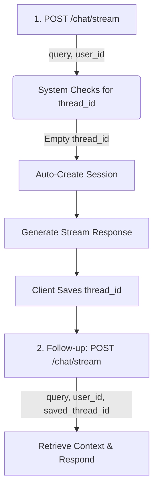
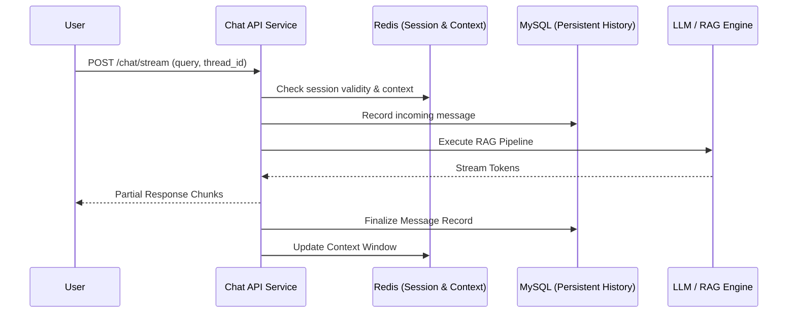

# Chat API Workflow

## 📋 Comprehensive Workflow Overview

### Method A: Quick Workflow (Auto-Creation)
**Best for simple integrations where sessions are managed dynamically.**



---

### Method B: Standard Workflow (Managed Sessions)
**Best for enterprise applications requiring explicit session control.**

```mermaid
graph TD
    A[1. POST /chat/sessions/create] -->|user_id, title| B[System Validates & Stores]
    B --> C[Return session_id]
    C --> D[2. POST /chat/stream]
    D -->|query, user_id, session_id| E[Retrieve Config & Respond]
    E --> F[3. Session Management]
    F --> G[GET /sessions - List All]
    F --> H[PUT /sessions/{id} - Rename]
    F --> I[DELETE /sessions/{id} - Purge]
```

---

## 🔄 Interaction Scenarios

### Scenario 1: First-Time User Inquiry (Quick Mode)
**Objective**: Start a conversation instantly without manual session setup.

```bash
# Step 1: Start chat (System auto-generates session)
curl -X POST http://localhost:8006/chat/stream \
  -H "Content-Type: application/json" \
  -d '{
    "query": "What is an APT attack?",
    "user_id": 1,
    "meta": {
      "title": "Threat Consultation",
      "system_prompt": "You are a professional CTI analyst."
    }
  }'

# Response contains: "thread_id": "uuid-1234-5678"
```

---

### Scenario 2: First-Time User (Standard Mode)
**Objective**: Pre-configure session metadata before the first interaction.

```bash
# Step 1: Create the session context
curl -X POST http://localhost:8006/chat/sessions/create \
  -H "Content-Type: application/json" \
  -d '{
    "user_id": 1,
    "title": "APT Analysis Report"
  }'

# Response: {"success": true, "session_id": "uuid-abcd-efgh"}
```

### Scenario 2b: Automatic Session Title Generation
**Objective**: Update a generic session title based on the conversation context.

```bash
# Generate a relevant title based on the last message
curl -X POST http://localhost:8006/chat/sessions/uuid-abcd-efgh/generate_title \
  -H "Content-Type: application/json" \
  -d '{
    "user_id": 1
  }'
```

### Scenario 3: Resuming an Existing Investigation
**Objective**: Fetch historical context and continue a multi-turn dialogue.

```bash
# Step 1: List all user sessions to find the target
curl "http://localhost:8006/chat/sessions?user_id=1"

# Step 2: Fetch message history for context (Optional for UI rendering)
curl "http://localhost:8006/chat/sessions/uuid-1234-5678/messages?user_id=1"

# Step 3: Resume dialogue using the thread_id
curl -X POST http://localhost:8006/chat/stream \
  -H "Content-Type: application/json" \
  -d '{
    "query": "Can you elaborate on the C2 infrastructure mentioned in the last report?",
    "thread_id": "uuid-1234-5678",
    "user_id": 1
  }'
```

---

### Scenario 4: Multi-Session Organization
**Objective**: Managing multiple parallel investigation tracks.

```bash
# Investigation A: Ransomware Trends
curl -X POST http://localhost:8006/chat/sessions/create -d '{"user_id": 1, "title": "Ransomware Analysis"}'
# -> returns sess-001

# Investigation B: Zero-Day Vulnerabilities
curl -X POST http://localhost:8006/chat/sessions/create -d '{"user_id": 1, "title": "Vulnerability Research"}'
# -> returns sess-002

# The UI can now toggle between these using their respective IDs.
```

---

### Scenario 5: Administrative Management
**Objective**: Renaming and purging sessions.

```bash
# Rename a session
curl -X PUT http://localhost:8006/chat/sessions/uuid-1234-5678 \
  -H "Content-Type: application/json" \
  -d '{
    "user_id": 1,
    "title": "Archived Investigation 2024"
  }'

# Delete a session
curl -X DELETE "http://localhost:8006/chat/sessions/uuid-1234-5678?user_id=1"
```

---

## ⚠️ Implementation Guidelines

### ✅ Correct Usage Patterns
1. **Initial Handshake**: Use `POST /chat/sessions/create` for structured environments.
2. **State Management**: Clients must persist the `thread_id` to maintain multi-turn coherence.
3. **Contextual Integrity**: Use the same `thread_id` for all messages within a single logical conversation.

### ❌ Anti-Patterns (Avoid)
- **Zombie IDs**: Sending a `thread_id` that does not exist or belongs to another user will result in a `404 Not Found` error.
- **User Mismatch**: Submitting a request with `user_id: 1` but a `thread_id` owned by `user_id: 2` will trigger a security rejection.
- **Empty Queries**: Submitting null or empty `query` strings will result in a validation error.

---

## 🛠 Deployment & Reliability

### Startup Sequence
When using Docker Compose, follow this recommended order to ensure service availability:

1. **RabbitMQ**: Ensure the message broker is fully healthy.
   ```bash
   docker compose up -d rabbitmq
   ```
2. **Worker Nodes**: Start `threatrag-worker` to handle health checks and routing logic.
   ```bash
   docker compose up -d threatrag-worker
   ```
3. **API Gateway**: Start `threatrag` (the main API) last to avoid queue congestion.
   ```bash
   docker compose up -d threatrag
   ```

---

## 📊 Technical Architecture Flow



---

## 📚 Related Documentation
- [Chat API Specification](chat-session-api.md): Detailed parameter definitions and schemas.
- [Quick Start Guide](chat-session-quickstart.md): Step-by-step setup for new developers.
- [Model Routing Guide](model-usage-examples.md): Configuring fallbacks and providers.
