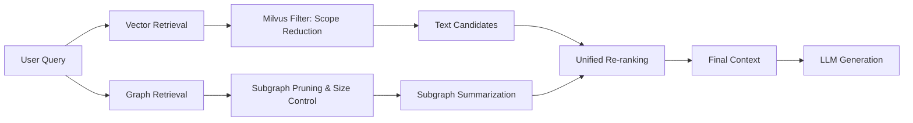

# Lessons Learned Building ThreatRAG: Solving Vector Degradation, Subgraph Explosion, and Hybrid Re-ranking

When I initiated the ThreatRAG project, my primary objective was to evolve traditional RAG architectures by bridging vector retrieval, knowledge graphs, and LLM responses within a specialized CTI (Cyber Threat Intelligence) context. The goal was to move beyond simple text recall and provide structured, relationship-aware evidence.

At a small scale, the pipeline worked seamlessly: documents were chunked and indexed into a vector store, entities were extracted into Neo4j, and the combined results were fed to the LLM. However, as the data volume scaled, the system encountered significant bottlenecks.

This retrospective focuses on three critical challenges that reshaped the architecture:
1. **Vector Recall Degradation**: Why performance drops as the knowledge base grows.
2. **Subgraph Explosion**: The danger of unconstrained relationship expansion.
3. **Hybrid Alignment**: Why graph and vector results cannot be re-ranked without preprocessing.

At scale, the core challenge of RAG shifts from "can it retrieve?" to **"can it remain within the limits of practical availability?"**

---

## 🏛 The Foundation: ThreatRAG is Hybrid-First

ThreatRAG is not just a document store; it employs a "GraphRAG" strategy:
- **Vector Retrieval**: Semantic matching at the chunk level.
- **Graph Retrieval**: Multi-hop relationship extraction to provide structured context.
- **Orchestration**: A unified pipeline that determines whether to use vector, graph, or hybrid evidence, followed by re-ranking.

The following diagram illustrates the stabilized architecture:



The critical success factors are **scope reduction**, **size control**, and **semantic alignment**.

---

## 🚩 Challenge 1: The Vector Scaling Trap

Initial intuition suggested that more data would lead to better recall. In reality, the opposite occurred. As the knowledge base grew, the "Top-K" results became saturated with "semi-relevant" noise—chunks that shared similar terminology or themes but lacked specific relevance to the query.

The problem wasn't the embedding model; it was the **unbounded search space**.

### The Solution: Metadata Filtering Before Vector Search
Instead of relying solely on semantic similarity, I integrated a pre-filtering layer in Milvus. By using metadata to bind the candidate pool (e.g., by `db_id`, `file_id`, or mission context), we cleaned the competitive environment for the Top-K algorithm.

**Optimized Retrieval Pattern:**
```python
def retrieve_from_milvus(query, db_id, file_ids=None):
    # Bind the search to a specific context/scope first
    filter_expr = f"db_id == '{db_id}'"
    if file_ids:
        filter_expr += f" and file_id in {file_ids}"

    return milvus_client.search(
        data=[embed(query)],
        filter=filter_expr,
        limit=10,
        output_fields=["text", "source"]
    )
```

**Key Takeaway**: Limiting the search space is often more effective than upgrading the embedding model.

---

## 🚩 Challenge 2: Subgraph Explosion

In CTI, relationships are highly interconnected (Attacker -> Malware -> Infrastructure -> Vulnerability). My original design attempted to expand all neighboring nodes around a hit entity. This led to a "combinatorial explosion":
- Core entities (e.g., common APTs or CVEs) are highly connected.
- Multi-hop expansion quickly hits token limits.
- The resulting context is a "relationship dump" rather than targeted evidence.

### The Solution: Controlled Pruning & Relationship Compression
I shifted from "as much as possible" to "as manageable as possible":
- **Seed Entity Caps**: Limiting the number of entry points for expansion.
- **Hop Constraints**: Strictly enforcing maximum expansion depth.
- **Edge Throttling**: Preventing high-degree nodes from flooding the context.

---

## 🚩 Challenge 3: The Alignment Gap in Hybrid Re-ranking

Combining text chunks and raw graph fragments for a re-ranker (like BGE-Reranker) often fails. 
- **Text Chunks**: Coherent, readable, and semantically dense.
- **Graph Fragments**: Structural but fragmented (Subject-Predicate-Object).

Re-rankers naturally bias toward text chunks due to their semantic completeness, often discarding critical structural evidence from the graph.

### The Solution: Subgraph Summarization
Before re-ranking, we convert the pruned subgraph into a **semantic summary**—a readable text block that describes the key relationships found. This aligns the graph evidence with the text chunks, allowing the re-ranker to compare "apples to apples."

```python
def build_rerank_candidates(text_chunks, subgraph):
    # Convert structural graph data into a semantic evidence block
    graph_summary = summarize_subgraph(subgraph)
    
    candidates = [{"type": "text", "content": c["text"]} for c in text_chunks]
    candidates.append({"type": "graph", "content": graph_summary})
    
    return rerank(query, candidates)
```

---

## 🎯 Summary: The "Availability First" Philosophy

These three challenges reveal a unified logic for production-grade RAG:
1. **Filter Early**: Clean the search space before performing heavy semantic operations.
2. **Constrain Growth**: Relationships are valuable only if they are focused. Uncontrolled graphs become noise.
3. **Align Evidence**: Heterogeneous data must be normalized into a common semantic format before ranking.

In a real-world system, it's rarely the model that is too weak; it's the context that is too messy. By focusing on **range control**, **evidence organization**, and **semantic alignment**, we can build RAG systems that remain robust and accurate at any scale.
