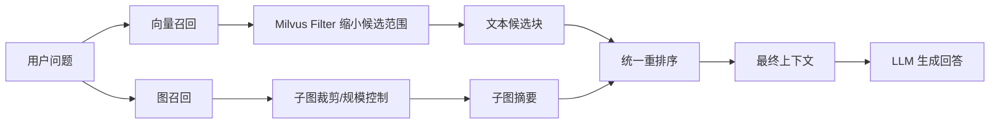
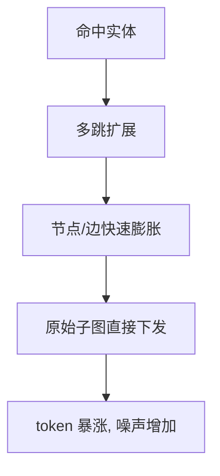
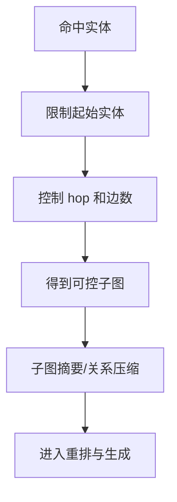
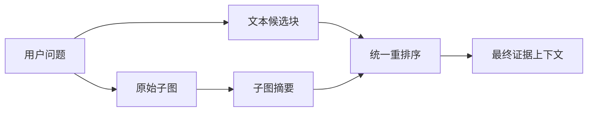

# 我在做 ThreatRAG 时踩过的 3 个坑：向量召回退化、子图爆炸与跨模态重排

做 ThreatRAG 这个项目时，我一开始的想法其实很直接：把传统 RAG 往前推一步，在网络威胁情报（CTI）场景里把向量检索、知识图谱和大模型回答串起来，尽量让系统既能召回文本证据，也能给出结构化关系。

在小规模数据上，这条链路看起来是成立的。文档切块之后进向量库，实体关系抽取之后进 Neo4j，查询进来先走检索，再把结果喂给模型生成回答。最初的问题不是“能不能跑起来”，而是“看起来都能跑”。真正的麻烦，基本都是在数据和图规模上来之后才出现的。

这篇文章不打算完整介绍 ThreatRAG 的所有模块，而是只复盘三个对我影响最大的坑：

1. 向量数量变多之后，召回率反而下降了。
2. 图召回一旦放开，子图规模很容易爆炸。
3. 图结果和向量结果看起来都叫“召回结果”，但其实并不能直接放在一起做重排序。

这三个问题表面上分别发生在向量检索、图检索和重排序阶段，但后来我回头看，它们本质上都指向同一件事：**RAG 系统一旦进入真实规模，问题就不再只是“能不能召回”，而是“能不能把召回控制在可用范围内”。**

## 先说背景：ThreatRAG 不是纯向量 RAG

ThreatRAG 这套链路不是单纯的“向量库 + LLM”。它更接近一个面向 CTI 场景的 GraphRAG：

- 文档会先切块并写入向量库，用来做文本层面的语义召回。
- 文档中的实体和关系会被抽出来写进图数据库，用来补足多跳关系和结构化证据。
- 查询进来之后，系统会按配置决定是否做知识库召回、图召回，以及最后的重排序和上下文融合。

这个方向本身没有问题，问题在于我一开始对“召回”的理解太理想化了。我默认觉得：数据更多，召回应该更好；图更丰富，证据应该更全；重排序放在后面，应该可以自动把坏结果压下去。后来我发现，这三个判断都只在规模还小的时候成立。

如果用一张图概括我后面真正稳定下来的链路，大概是下面这样：



这张图里真正关键的不是“有多少模块”，而是三个控制点：

- 向量召回前先收缩候选空间。
- 图召回后先控制子图规模。
- 图结果先摘要成语义块，再跟文本一起重排。

## 坑一：向量变多后，召回率反而下降

最早做知识库检索的时候，我的直觉非常朴素：既然向量检索是做语义相似度匹配，那数据越多，理论上可选证据就越丰富，召回效果应该更稳才对。

结果恰好相反。随着文档量增长、chunk 数量变多，我开始越来越频繁地遇到一种情况：用户问题明明是对的，知识库里也确实有相关内容，但 top-k 里会混进大量“看起来相似、实际上没用”的 chunk。更糟的是，这些噪声 chunk 往往并不是完全不相关，它们只是停留在同主题、同术语、同场景的表面相似层面，恰好足以把真正关键的片段挤出去。

一开始我把问题想歪了。我先怀疑 embedding 模型不够强，后面又怀疑切块粒度不对，甚至一度想过是不是要继续堆更复杂的 reranker。后来回头看，真正的问题没有那么“模型化”，反而更工程一些：**检索空间太大了。**

当向量库里同时存在不同来源、不同主题、不同文件层级的 chunk 时，单纯依赖全局相似度搜索，其实是在一个过大的候选空间里做 top-k 竞争。问题不是模型完全分不出相关和不相关，而是当大量“半相关”候选同时存在时，真正高价值的片段很容易被噪声稀释。

### 我最后的修正：先用 Milvus filter 缩小候选空间，再做向量召回

这件事想通之后，调整方向就变了：我不再把重点放在“怎么让模型更懂”，而是先解决“怎么别让模型在错误范围里找”。

具体做法就是在 Milvus 侧加 `filter`，先用元数据约束候选集合，再执行相似度检索。比如：

- 先限制知识库范围，而不是全库混搜。
- 按文件、来源、任务上下文或实体关联范围做预过滤。
- 把本次问题无关的数据块尽量挡在相似度计算之外。

这样做的价值不在于让模型突然变聪明，而在于让 top-k 的竞争环境变干净了。原来是“所有相似候选一起抢位置”，加了 filter 之后变成“更有可能相关的一小批候选里再排前几名”。从实际效果看，召回结果的稳定性会明显好很多，真正相关片段进入前几位的概率也更高。

如果用伪代码表达，我后面会更倾向于把向量召回写成下面这个思路：

```python
def retrieve_from_milvus(query, db_id, file_ids=None, source=None):
    filter_parts = [f"db_id == '{db_id}'"]

    if file_ids:
        file_expr = ", ".join([f"'{fid}'" for fid in file_ids])
        filter_parts.append(f"file_id in [{file_expr}]")

    if source:
        filter_parts.append(f"source == '{source}'")

    filter_expr = " and ".join(filter_parts)

    return milvus_client.search(
        collection_name="threatrag_chunks",
        data=[embed(query)],
        anns_field="vector",
        limit=10,
        filter=filter_expr,
        output_fields=["file_id", "text", "source"],
    )
```

重点不是这段代码本身，而是检索顺序变了。以前我的思路更像是：

```python
results = milvus.search(query_vector, top_k=10)
results = rerank(results)
```

后来我更接受这种顺序：

```python
candidate_scope = filter_by_metadata(db_id, file_ids, source)
results = milvus.search(query_vector, filter=candidate_scope, top_k=10)
results = rerank(results)
```

差别在于，`rerank` 不应该承担“从整个噪声空间里救回正确结果”的职责。它应该只在一个已经相对干净的候选集合里做精排。

这一步对我的启发很大，因为它改变了我看待知识库召回的方式：**在知识库检索里，先约束搜索空间，往往比继续调 embedding 更有效。**  
很多时候召回退化不是模型不够强，而是搜索空间不够干净。

## 坑二：图召回时子图爆炸

向量召回的问题还算常规，图召回的问题就更“GraphRAG”了。

我最初对图召回的设计是：既然 CTI 问题经常涉及攻击者、样本、基础设施、漏洞、攻击手法这些多跳关系，那就可以围绕命中的实体向外扩展邻居，做一个局部子图，把结构化证据一起送给下游模型。

这个思路在小图上是好用的。只要节点和边不多，局部扩展出来的子图很快就能把关系链补齐，模型看到的上下文也更完整。

但图一旦变大，问题会迅速出现。尤其是当某些核心实体本身连接度很高时，多跳扩展会带来非常典型的组合爆炸：

- hop 稍微放大，候选节点数会迅速增长。
- 边的数量往往比节点涨得更快。
- 最终送进下游的上下文，不再是“围绕当前问题的证据图”，而更像是“某个实体附近能碰到的所有关系堆积”。

这类问题最麻烦的地方在于，它不是完全错误的召回。你很难说这些边绝对无关，因为它们从图结构上确实都连着；但它们又经常并不真正服务当前问题。结果就是 token 飙升、噪声增加、答案变得更不稳定。

一开始我也犯过一个很典型的误判：我以为图召回的问题在于“还不够全”，所以我尝试过放大 hop、增加种子实体、尽量多保留边。后来发现这恰好走反了。**GraphRAG 很多时候的问题不是召不到，而是召太多。**

### 我最后的修正：先控制子图规模，再把原始图变成可读证据

图召回这块，我最后不是靠一个单点优化解决的，而是把思路从“尽量多拿”改成“尽量可控”。

我主要做了几件事：

- 先限制起始实体，不让所有命中实体都同时扩展。
- 控制 hop，不把多跳扩展默认当成越大越好。
- 给边数和子图规模设置上限，避免局部高连接节点把整个上下文拖爆。
- 最关键的一点是，不再把原始子图直接交给下游重排序和生成。

这最后一点特别重要。因为原始子图本身并不是适合直接消费的证据形式。它更像是“候选结构”，不是“最终上下文”。如果把图数据库里拉出来的节点和边原样扔给后面的模块，后面看到的其实是一堆结构碎片，而不是一组可比较、可压缩、可推理的证据单元。

所以我后面做的，不只是“裁剪子图”，而是把图召回的目标从“拿到子图”改成“拿到足够小、足够关键、可表达的子图”。

如果画成流程，子图爆炸和后来的修正差别大概是这样的：



后来我改成了另一条链路：



从结果看，这种做法带来的收益很直接：一方面上下文规模能压住，另一方面关键关系并没有因为压缩就全部丢掉。对图召回来说，真正有用的不是“图有多大”，而是“当前问题真正需要看到多少结构证据”。

## 坑三：图和向量结果不能直接混在一起重排序

第三个坑，算是前两个问题叠加之后自然暴露出来的。

当时我的想法很自然：既然最终都要给模型一个“更优的上下文”，那就把文本召回结果和图召回结果汇总起来，一起丢给 reranker，让它做统一排序不就行了？

听起来非常合理，但真正做起来效果并不好。原因也很简单：**图结果和向量结果虽然都叫召回结果，但它们根本不是同一种东西。**

向量召回返回的通常是自然语言 chunk。它本身就是可读文本，句子结构、上下文边界、语义密度都比较接近用户问题。  
图召回返回的则往往是节点、边、关系片段，或者是非常碎的三元组表达。它在结构上是对的，但在语义层面并不是面向阅读和比较优化过的。

问题就出在这里。如果把自然语言段落和图关系碎片直接放在一起让 reranker 打分，排序本身会变得很不稳定：

- 文本 chunk 往往因为表达完整，更容易拿到高分。
- 图边虽然可能关键，但因为粒度太碎，语义上不够“像答案证据”，分数容易偏低。
- 即使图边进入排序结果，最终上下文也容易变成“文本片段 + 结构碎片混排”，对生成模型并不友好。

这个问题后来让我意识到，异构证据并不能因为都进入了“召回阶段”，就自动进入同一个比较空间。**重排序不是万能胶。**

### 我最后的修正：先对子图做摘要，再参与统一重排

真正有效的改法不是“继续换更强的 reranker”，而是先解决输入形式的问题。

我的做法是先把图召回出来的子图转成摘要或关系描述块，再把它和文本 chunk 一起交给 reranker。这样做的核心不是美化输出，而是把图证据先压缩成一个可以被比较的语义单元。

这个过程可以理解成两步：

1. 图召回负责把结构范围缩小到一个可控子图。
2. 子图摘要负责把结构化关系翻译成自然语言证据块。

等到了这一步，重排序才真正有意义。因为 reranker 面对的不再是“自然语言段落 vs 图数据库边”，而是“不同来源的证据块”。它们虽然来源不同，但至少在表达层面已经更接近了。

我现在更认可的重排逻辑，接近下面这种形式：

```python
def build_rerank_candidates(text_chunks, subgraph):
    text_candidates = [
        {"type": "text", "content": chunk["text"]}
        for chunk in text_chunks
    ]

    graph_summary = summarize_subgraph(subgraph)
    graph_candidates = [
        {"type": "graph_summary", "content": graph_summary}
    ]

    return text_candidates + graph_candidates


def rerank_candidates(query, candidates):
    pairs = [[query, item["content"]] for item in candidates]
    scores = reranker.compute_score(pairs)
    return sorted(zip(candidates, scores), key=lambda x: x[1], reverse=True)
```

核心不是 `summarize_subgraph()` 这个函数具体怎么实现，而是图结果在进入 `rerank` 之前，先从“结构”变成“语义块”。

这一段如果画成流程图，会更容易看出我为什么后面不再让图边直接参与混排：



这样做之后，排序结果会稳定很多。最终送给生成模型的上下文也更像一组有组织的证据，而不是把结构数据硬拼进去的混合杂糅物。

这件事带给我的结论非常明确：**不要让 reranker 直接面对裸图结构，先把图压成可比较的语义单元。**  
如果异构证据不先对齐表达，分数本身就不可靠。

## 回头看，这三个坑其实是同一个问题

写到这里再回头看，我觉得这三个问题虽然发生在不同阶段，但底层逻辑很一致。

向量召回退化，说到底是搜索空间没有被约束。  
子图爆炸，说到底是结构召回没有被控制。  
图和向量无法稳定混排，说到底是异构证据没有先做表达对齐。

所以如果现在让我把这段经历压缩成三条经验，我会这么总结：

### 1. 检索前先缩小搜索空间

不要默认“更多候选 = 更好召回”。在知识库规模变大之后，约束候选集合本身就是召回质量的一部分。Milvus filter 这类能力，很多时候不是优化项，而是必要项。

### 2. 图召回先控规模，再谈覆盖

GraphRAG 不是把更多边塞进上下文里就会更强。图证据的价值来自相关性，不来自体积。只要子图失控，后面的总结、重排和生成都会跟着一起失控。

### 3. 异构证据先统一表达，再做统一排序

文本和图都可以成为证据，但它们不应该在原始状态下直接竞争排序分数。先把结构化结果压成可读、可比较的语义块，再做统一排序，整个链路会稳定得多。

## 结尾

ThreatRAG 这个项目让我很直观地体会到一件事：RAG 系统的难点，从来不只是在“召回”和“生成”这两个词本身，而是在真实规模下，怎么把召回结果控制在一个下游模型真正能消费的范围里。

我以前会更关注“有没有召回来”，后来越来越关注“召回的是不是干净”“子图是不是已经失控”“这些证据能不能被统一处理”。从这个角度看，这篇文章里写的三个坑，其实不是某个模型、某个库、某个参数的问题，而是系统设计视角的问题。

如果后面还继续迭代 ThreatRAG，我大概率也还是会围绕这条线继续做：先控制范围，再组织证据，最后再谈模型效果。因为在真实系统里，很多时候不是模型太弱，而是上下文太乱。
