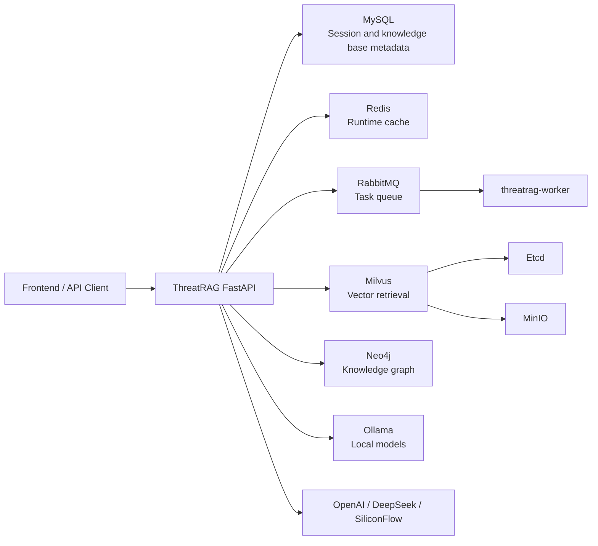

# ThreatRAG

[](https://oosmetrics.com/repo/Ais1on/CTI-RAG)

ThreatRAG is a RAG system for Cyber Threat Intelligence (CTI). It is not limited to text Q&A; it connects knowledge base retrieval, knowledge graph, multi-model routing, hybrid retrieval, session management, and background tasks into a deployable threat intelligence analysis backend.

The goal is to enable security analysts to perform traceable multi-hop analysis around entities such as threat actors, malware, vulnerabilities, infrastructure, and attack campaigns, instead of only returning a few similar text snippets.

## Core Capabilities

### CTI RAG Q&A

- Supports knowledge-base-oriented threat intelligence Q&A.
- Supports file upload, text chunking, vectorization, and similarity retrieval.
- Supports streaming chat APIs for real-time frontend rendering.
- Supports controlling knowledge base and model selection through parameters like `meta.db_id`, `meta.model_provider`, and `meta.model_name`.

### Knowledge Graph

- Extracts entities and relationships from CTI text and stores them as a queryable graph structure.
- Uses Neo4j to store threat entities, relationships, and indexing results.
- Provides APIs for graph indexer start, stop, status query, and immediate run.
- Supports file-based entity extraction tasks for batch conversion of threat reports into graph data.

### Hybrid Retrieval

- Combines vector retrieval, graph queries, query rewriting, and reranking capabilities.
- For multi-hop questions, structured relationships and text evidence can be used together as answer context.
- Suitable for relationship-based questions like “Which vulnerabilities has a threat actor used?” or “Which threat entities are within two hops around an IP?”.

### Multi-Model Routing

- Supports integration with model providers such as OpenAI, DeepSeek, Ollama, and SiliconFlow.
- Supports default model, fallback chain, request timeout, stream timeout, and retry count per model.
- Supports model circuit breaker configuration for graceful degradation when a model fails.
- Chat responses return routing metadata so you can verify the actual model used and whether degradation occurred.

### Multi-Session Chat

- Supports automatic session creation and explicit session creation before continuing a conversation.
- Sessions are bound to `user_id` for user-level isolation.
- Uses MySQL to persist sessions and messages, and Redis to accelerate runtime reads.
- Provides APIs for session list, session details, session update, session deletion, and message deletion.

### Background Tasks

- Uses RabbitMQ to publish background tasks.
- `threatrag-worker` runs independently for async task handling and runtime health checks.
- API and worker images are separated for independent scaling in production.

## System Architecture



The current Docker Compose deployment includes:

| Service | Purpose | Default Port |
| --- | --- | --- |
| `threatrag` | FastAPI backend | `8006:8000` |
| `threatrag-worker` | Background task worker | No external port |
| `mysql` | Session and metadata storage | `3309:3306` |
| `redis` | Cache and runtime state | `6379:6379` |
| `rabbitmq` | Task queue and management UI | `5672:5672`, `15672:15672` |
| `neo4j` | Knowledge graph database | `7475:7474`, `7688:7687` |
| `milvus-standalone` | Vector database | `19530:19530`, `9091:9091` |
| `minio` | Object storage dependency for Milvus | `9000:9000`, `9001:9001` |
| `etcd` | Metadata dependency for Milvus | Container-internal access |
| `ollama` | Local model service | `11434:11434` |

## Repository Structure

```text
ThreatRAG/
├── rag/
│   ├── api/routers/        # FastAPI routers: chat/data/graph/auth
│   ├── cache/              # Redis session and runtime cache
│   ├── config/             # Runtime configuration
│   ├── mq/                 # RabbitMQ publishers and workers
│   └── vector/             # Vector database wrappers
├── packages/
│   ├── core/               # Retrieval, knowledge base, graph, entity extraction, RL reasoning
│   ├── manager/            # MySQL, Milvus, Neo4j, session management
│   ├── models/             # Chat model, embedding, rerank, model router
│   ├── plugins/            # OCR, OneKE, and plugin capabilities
│   └── utils/              # Prompt, logging, BM25, web search, and utilities
├── docs/                   # API, deployment, model, and engineering documentation
├── tests/                  # Unit tests and runtime wiring tests
├── models/                 # Local models and inference weights
├── data/                   # Local persistent data directory for Docker Compose
├── Dockerfile              # API image
├── Dockerfile.worker       # Worker image
├── docker-compose.yml      # Recommended deployment entrypoint
├── config.yaml             # Application feature flags and local config
├── main.py                 # Local FastAPI startup entrypoint
└── worker.py               # Local worker startup entrypoint
```

## Quick Deployment

It is recommended to use Docker Compose to start the full environment. This brings up API, worker, MySQL, Redis, RabbitMQ, Neo4j, Milvus, MinIO, Etcd, and Ollama together.

### 1. Clone the repository

```bash
git clone https://github.com/Ais1on/CTI-RAG.git
cd CTI-RAG
```

### 2. Create `.env`

Create `.env` in the repository root and configure at least the model keys you need.

```dotenv
# Runtime environment
FASTAPI_ENV=production

# Cloud model keys (fill as needed)
OPENAI_API_KEY=
DEEPSEEK_API_KEY=
ZHIPUAI_API_KEY=
SILICONFLOW_API_KEY=
SILICONFLOW_API_BASE=https://api.siliconflow.cn/v1

# Neo4j
NEO4J_USERNAME=neo4j
NEO4J_PASSWORD=12345678

# Multi-model routing
MODEL_ROUTER_ENABLED=true
MODEL_ROUTER_DEFAULT_PROVIDER=deepseek
MODEL_ROUTER_DEFAULT_MODEL=deepseek-chat
MODEL_ROUTER_FALLBACK_CHAIN=deepseek:deepseek-chat,ollama:qwen3:30b,ollama:qwen2.5:7b
MODEL_ROUTER_REQUEST_TIMEOUT_SECONDS=45
MODEL_ROUTER_STREAM_TIMEOUT_SECONDS=90
MODEL_ROUTER_MAX_RETRIES_PER_MODEL=1

# Model circuit breaker
MODEL_CIRCUIT_BREAKER_ENABLED=true
MODEL_CIRCUIT_BREAKER_FAILURE_THRESHOLD=5
MODEL_CIRCUIT_BREAKER_FAILURE_WINDOW_SECONDS=60
MODEL_CIRCUIT_BREAKER_OPEN_SECONDS=120
MODEL_CIRCUIT_BREAKER_HALF_OPEN_PROBES=2
```

If you only use Ollama local models, cloud model keys can be left empty first, but you need to pull the required models inside the Ollama container.

### 3. Build images

```bash
docker compose build threatrag threatrag-worker
```

### 4. Start services

```bash
docker compose up -d
```

Check service status:

```bash
docker compose ps
```

View API logs:

```bash
docker compose logs -f threatrag
```

Verify API:

```bash
curl http://localhost:8006/health
```

Expected response:

```json
{"message":"status","status":"ok"}
```

### 5. Pull Ollama models

If using local models, enter the Ollama container after startup and pull models:

```bash
docker exec -it threatrag-ollama ollama pull qwen3:30b
docker exec -it threatrag-ollama ollama pull qwen2.5:7b
```

View model list:

```bash
docker exec -it threatrag-ollama ollama list
```

## Local Development

For local development, it is still recommended to start infrastructure with Docker Compose first, then run API on the host. Note: service addresses in `docker-compose.yml` target the container network; when running `python ./main.py` directly on host, adjust Redis, MySQL, Neo4j, Milvus, Ollama, etc. to reachable hostnames or `localhost` mapped ports in your environment.

```bash
pip install -r requirements.txt
docker compose up -d mysql redis rabbitmq neo4j etcd minio milvus-standalone ollama
python ./main.py
```

Main flags in `config.yaml`:

```yaml
enable_reranker: true
enable_knowledge_base: true
enable_knowledge_graph: true
enable_web_search: true
enable_hybrid_retrieval: true

model_provider: "ollama"
model_name: "qwen3:30b"
embed_model: "dashscope/text-embedding-v4"
reranker: "zhipu/rerank"
```

If GPU is not mounted correctly on host or container, keep `device` and `rl_device` as `cpu` in `config.yaml` first.

## Common APIs

By default, Docker Compose exposes APIs at `http://localhost:8006`.

### Health check

```bash
curl http://localhost:8006/health
```

### Streaming chat

If `thread_id` is not provided, a session is created automatically:

```bash
curl -X POST http://localhost:8006/chat/stream \
  -H "Content-Type: application/json" \
  -d '{
    "query": "Analyze common attack chains of APT29",
    "user_id": 1,
    "meta": {
      "title": "APT Analysis",
      "model_provider": "deepseek",
      "model_name": "deepseek-chat"
    }
  }'
```

Continue an existing session:

```bash
curl -X POST http://localhost:8006/chat/stream \
  -H "Content-Type: application/json" \
  -d '{
    "query": "Which vulnerabilities are involved in these attack chains?",
    "user_id": 1,
    "thread_id": "thread_id returned from previous response"
  }'
```

### Session management

| Method | Path | Description |
| --- | --- | --- |
| `POST` | `/chat/sessions/create` | Create session |
| `GET` | `/chat/sessions` | List user sessions |
| `GET` | `/chat/sessions/{thread_id}` | Get session details |
| `PUT` | `/chat/sessions/{thread_id}` | Update session |
| `DELETE` | `/chat/sessions/{thread_id}` | Delete session |
| `GET` | `/chat/sessions/{thread_id}/messages` | Get message history |
| `DELETE` | `/chat/sessions/{thread_id}/messages/{message_id}` | Delete message |

### Knowledge base and files

| Method | Path | Description |
| --- | --- | --- |
| `POST` | `/data/upload` | Upload file |
| `POST` | `/data/add-by-file` | Write to knowledge base by file |
| `POST` | `/data/add-by-chunks` | Write to knowledge base by text chunks |
| `GET` | `/data/files` | List files |
| `GET` | `/data/user-knowledge-bases` | List user knowledge bases |
| `DELETE` | `/data/document` | Delete document |

### Knowledge graph

| Method | Path | Description |
| --- | --- | --- |
| `GET` | `/graph/info` | Query graph status |
| `POST` | `/graph/start-indexer` | Start graph indexer |
| `POST` | `/graph/stop-indexer` | Stop graph indexer |
| `GET` | `/graph/indexer-status` | Query indexer status |
| `POST` | `/graph/run-indexer-now` | Run indexer immediately |
| `POST` | `/graph/extract-entities-from-file` | Extract entities from file |
| `POST` | `/graph/extract-entities-task` | Create entity extraction task |
| `GET` | `/graph/extract-entities-task/status` | Query extraction task status |
| `GET` | `/graph/extract-entities-task/result` | Query extraction task result |

### Authentication and users

| Method | Path | Description |
| --- | --- | --- |
| `POST` | `/auth/register` | Register user |
| `POST` | `/auth/token` | Login and get token |
| `GET` | `/auth/me` | Get current user |
| `GET` | `/auth/users` | List users |

For more API details, see:

- [Frontend API Guide](docs/frontend-api-guide.md)
- [Chat API Summary](docs/chat-api-summary.md)
- [Chat Session Quickstart](docs/chat-session-quickstart.md)
- [Multi-Model Usage Guide](docs/model-usage-examples.md)

## Data Persistence

Docker Compose mounts stateful data into the repository `data/` directory by default:

```text
data/
├── mysql/      # MySQL data
├── redis/      # Redis data
├── rabbitmq/   # RabbitMQ data
├── neo4j/      # Neo4j graph database
├── etcd/       # Etcd data
├── minio/      # MinIO data
├── milvus/     # Milvus vector data
└── ollama/     # Ollama local models
```

For backup, you can back up the entire `data/` directory:

```bash
tar -czf threatrag-data-backup.tar.gz data/
```

If older versions used Docker volumes, refer to migration notes in [Data Storage Notes](docs/README-volume-section.md).

## FAQ

### API starts slowly

On first startup, wait for MySQL, Redis, RabbitMQ, Neo4j, Milvus, and Ollama health checks to complete. Use the following commands to check dependency status:

```bash
docker compose ps
docker compose logs -f threatrag
```

### Ollama has no available model

Enter the container and pull a model:

```bash
docker exec -it threatrag-ollama ollama pull qwen2.5:7b
```

Then ensure the model name in `.env` or `config.yaml` matches `ollama list`.

### GPU unavailable

If NVIDIA Container Toolkit is not installed on host, the Ollama GPU container may not work properly. You can use CPU mode first or run the helper script:

```bash
bash scripts/setup-nvidia-docker.sh
```

### Neo4j Browser URL

In Docker Compose, Neo4j HTTP port mapping is `7475:7474`; access:

```text
http://localhost:7475/browser/
```

Bolt address:

```text
bolt://localhost:7688
```

Default credentials:

```text
neo4j / 12345678
```

## Frontend

Frontend repository:

[https://github.com/rstarall/br-cti-chat](https://github.com/rstarall/br-cti-chat)

For frontend integration, read [Frontend API Guide](docs/frontend-api-guide.md) first, especially the line-by-line JSON streaming response of `/chat/stream` and `thread_id` persistence logic.

## Related Documentation

- [ThreatRAG Knowledge Graph Introduction](chapter1-cti-kg-intro.md)
- [Chat API Workflow](docs/chat-api-workflow.md)
- [Chat API Summary](docs/chat-api-summary.md)
- [Chat Session API](docs/chat-session-api.md)
- [Multi-Model Usage Guide](docs/model-usage-examples.md)
- [Ollama Setup Guide](docs/ollama-setup.md)
- [CTI RAG Interview Q&A](docs/cti_rag_interview_qa.md)

## License

This project is licensed under the MIT License. See [LICENSE](LICENSE) for details.
