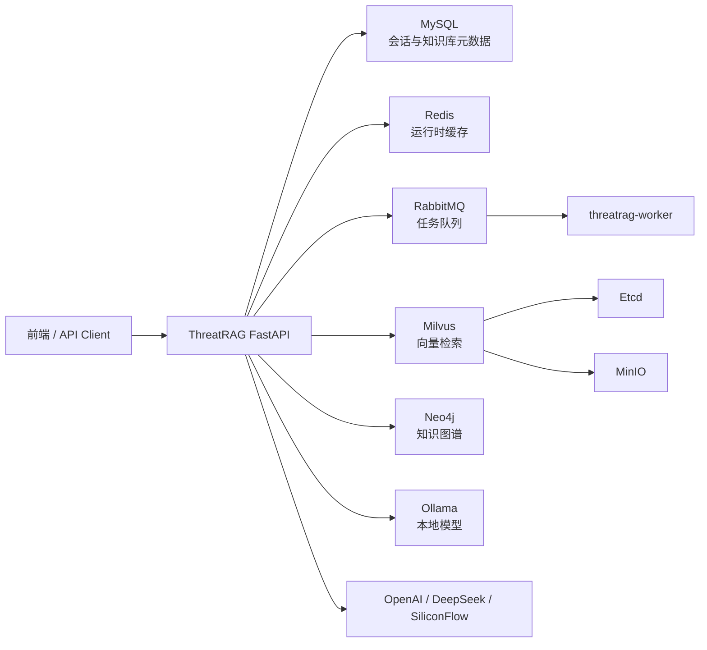

# ThreatRAG

[](https://oosmetrics.com/repo/Ais1on/CTI-RAG)

ThreatRAG 是一个面向网络威胁情报（Cyber Threat Intelligence, CTI）的 RAG 系统。它不仅做文本问答，还把知识库检索、知识图谱、多模型路由、混合检索、会话管理和后台任务串成一套可部署的威胁情报分析后端。

项目目标是让安全分析师能够围绕攻击组织、恶意软件、漏洞、基础设施、攻击活动等实体进行可追溯的多跳分析，而不是只返回几段相似文本。

## 核心能力

### CTI RAG 问答

- 支持面向知识库的威胁情报问答。
- 支持文件上传、文本分块、向量化和相似度检索。
- 支持流式聊天接口，适合前端实时展示回答。
- 支持通过 `meta.db_id`、`meta.model_provider`、`meta.model_name` 等参数控制知识库和模型。

### 知识图谱

- 从 CTI 文本中抽取实体与关系，沉淀为可查询的图结构。
- 使用 Neo4j 存储威胁实体、关系和索引结果。
- 提供图谱索引器启动、停止、状态查询和立即执行接口。
- 支持文件实体抽取任务，适合把威胁报告批量转为图谱数据。

### 混合检索

- 结合向量检索、图谱查询、查询改写和 rerank 能力。
- 面向多跳问题时，可以把结构化关系和文本证据共同作为回答上下文。
- 适合回答“某攻击组织使用了哪些漏洞”“某 IP 周围两跳内有哪些威胁实体”这类关系型问题。

### 多模型路由

- 支持 OpenAI、DeepSeek、Ollama、SiliconFlow 等模型来源的接入配置。
- 支持默认模型、回退链、请求超时、流式超时和单模型重试次数。
- 支持模型熔断配置，便于在模型异常时降级到备用模型。
- 聊天响应会返回路由元数据，便于判断实际使用模型和是否发生降级。

### 多会话聊天

- 支持自动创建会话，也支持显式创建会话后继续对话。
- 会话与 `user_id` 绑定，便于做用户级隔离。
- 使用 MySQL 持久化会话和消息，使用 Redis 加速运行时读取。
- 提供会话列表、会话详情、更新会话、删除会话和删除消息接口。

### 后台任务

- 使用 RabbitMQ 投递后台任务。
- `threatrag-worker` 独立运行，适合处理异步任务和运行时健康检查。
- API 镜像和 worker 镜像分离，便于生产环境独立扩缩容。

## 系统架构



当前 Docker Compose 部署包含：

| 服务 | 作用 | 默认端口 |
| --- | --- | --- |
| `threatrag` | FastAPI 后端 | `8006:8000` |
| `threatrag-worker` | 后台任务 worker | 无外部端口 |
| `mysql` | 会话与元数据存储 | `3309:3306` |
| `redis` | 缓存与运行时状态 | `6379:6379` |
| `rabbitmq` | 任务队列与管理后台 | `5672:5672`, `15672:15672` |
| `neo4j` | 知识图谱数据库 | `7475:7474`, `7688:7687` |
| `milvus-standalone` | 向量数据库 | `19530:19530`, `9091:9091` |
| `minio` | Milvus 对象存储依赖 | `9000:9000`, `9001:9001` |
| `etcd` | Milvus 元数据依赖 | 容器内访问 |
| `ollama` | 本地模型服务 | `11434:11434` |

## 仓库结构

```text
ThreatRAG/
├── rag/
│   ├── api/routers/        # FastAPI 路由：chat/data/graph/auth
│   ├── cache/              # Redis 会话与运行时缓存
│   ├── config/             # 运行时配置
│   ├── mq/                 # RabbitMQ 发布者与 worker
│   └── vector/             # 向量数据库相关封装
├── packages/
│   ├── core/               # 检索、知识库、图谱、实体抽取、RL 推理
│   ├── manager/            # MySQL、Milvus、Neo4j、会话管理
│   ├── models/             # Chat model、embedding、rerank、model router
│   ├── plugins/            # OCR、OneKE 等插件能力
│   └── utils/              # Prompt、日志、BM25、Web search 等工具
├── docs/                   # API、部署、模型和研发文档
├── tests/                  # 单元测试和运行时 wiring 测试
├── models/                 # 本地模型与推理权重目录
├── data/                   # Docker Compose 本地持久化数据目录
├── Dockerfile              # API 镜像
├── Dockerfile.worker       # Worker 镜像
├── docker-compose.yml      # 推荐部署入口
├── config.yaml             # 应用功能开关与本地配置
├── main.py                 # FastAPI 本地启动入口
└── worker.py               # Worker 本地启动入口
```

## 快速部署

推荐使用 Docker Compose 启动完整环境。这样会同时拉起 API、worker、MySQL、Redis、RabbitMQ、Neo4j、Milvus、MinIO、Etcd 和 Ollama。

### 1. 克隆仓库

```bash
git clone https://github.com/Ais1on/CTI-RAG.git
cd CTI-RAG
```

### 2. 创建 `.env`

在仓库根目录创建 `.env`，至少配置你要使用的模型密钥。

```dotenv
# 运行环境
FASTAPI_ENV=production

# 云端模型密钥，按需填写
OPENAI_API_KEY=
DEEPSEEK_API_KEY=
ZHIPUAI_API_KEY=
SILICONFLOW_API_KEY=
SILICONFLOW_API_BASE=https://api.siliconflow.cn/v1

# Neo4j
NEO4J_USERNAME=neo4j
NEO4J_PASSWORD=12345678

# 多模型路由
MODEL_ROUTER_ENABLED=true
MODEL_ROUTER_DEFAULT_PROVIDER=deepseek
MODEL_ROUTER_DEFAULT_MODEL=deepseek-chat
MODEL_ROUTER_FALLBACK_CHAIN=deepseek:deepseek-chat,ollama:qwen3:30b,ollama:qwen2.5:7b
MODEL_ROUTER_REQUEST_TIMEOUT_SECONDS=45
MODEL_ROUTER_STREAM_TIMEOUT_SECONDS=90
MODEL_ROUTER_MAX_RETRIES_PER_MODEL=1

# 模型熔断
MODEL_CIRCUIT_BREAKER_ENABLED=true
MODEL_CIRCUIT_BREAKER_FAILURE_THRESHOLD=5
MODEL_CIRCUIT_BREAKER_FAILURE_WINDOW_SECONDS=60
MODEL_CIRCUIT_BREAKER_OPEN_SECONDS=120
MODEL_CIRCUIT_BREAKER_HALF_OPEN_PROBES=2
```

如果只使用 Ollama 本地模型，可以先不填云端模型密钥，但需要在 Ollama 容器中拉取对应模型。

### 3. 构建镜像

```bash
docker compose build threatrag threatrag-worker
```

### 4. 启动服务

```bash
docker compose up -d
```

查看服务状态：

```bash
docker compose ps
```

查看 API 日志：

```bash
docker compose logs -f threatrag
```

验证 API：

```bash
curl http://localhost:8006/health
```

预期返回：

```json
{"message":"status","status":"ok"}
```

### 5. 拉取 Ollama 模型

如果使用本地模型，启动后进入 Ollama 容器拉取模型：

```bash
docker exec -it threatrag-ollama ollama pull qwen3:30b
docker exec -it threatrag-ollama ollama pull qwen2.5:7b
```

查看模型列表：

```bash
docker exec -it threatrag-ollama ollama list
```

## 本地开发

本地开发建议仍然先用 Docker Compose 启动基础设施，再在宿主机运行 API。注意：`docker-compose.yml` 中的服务地址面向容器网络，宿主机直跑 `python ./main.py` 时，需要按你的环境把 Redis、MySQL、Neo4j、Milvus、Ollama 等地址调整为可访问的主机名或 `localhost` 映射端口。

```bash
pip install -r requirements.txt
docker compose up -d mysql redis rabbitmq neo4j etcd minio milvus-standalone ollama
python ./main.py
```

`config.yaml` 中的主要开关：

```yaml
enable_reranker: true
enable_knowledge_base: true
enable_knowledge_graph: true
enable_web_search: true
enable_hybrid_retrieval: true

model_provider: "ollama"
model_name: "qwen3:30b"
embed_model: "dashscope/text-embedding-v4"
reranker: "zhipu/rerank"
```

如果宿主机或容器没有正确挂载 GPU，可以先把 `config.yaml` 中的 `device` 和 `rl_device` 保持为 `cpu`。

## 常用 API

API 默认通过 Docker Compose 暴露在 `http://localhost:8006`。

### 健康检查

```bash
curl http://localhost:8006/health
```

### 流式聊天

不传 `thread_id` 时会自动创建会话：

```bash
curl -X POST http://localhost:8006/chat/stream \
  -H "Content-Type: application/json" \
  -d '{
    "query": "分析 APT29 常见攻击链",
    "user_id": 1,
    "meta": {
      "title": "APT 分析",
      "model_provider": "deepseek",
      "model_name": "deepseek-chat"
    }
  }'
```

继续已有会话：

```bash
curl -X POST http://localhost:8006/chat/stream \
  -H "Content-Type: application/json" \
  -d '{
    "query": "这些攻击链里涉及哪些漏洞？",
    "user_id": 1,
    "thread_id": "上一轮返回的 thread_id"
  }'
```

### 会话管理

| 方法 | 路径 | 说明 |
| --- | --- | --- |
| `POST` | `/chat/sessions/create` | 创建会话 |
| `GET` | `/chat/sessions` | 查询用户会话列表 |
| `GET` | `/chat/sessions/{thread_id}` | 查询会话详情 |
| `PUT` | `/chat/sessions/{thread_id}` | 更新会话 |
| `DELETE` | `/chat/sessions/{thread_id}` | 删除会话 |
| `GET` | `/chat/sessions/{thread_id}/messages` | 查询消息历史 |
| `DELETE` | `/chat/sessions/{thread_id}/messages/{message_id}` | 删除消息 |

### 知识库与文件

| 方法 | 路径 | 说明 |
| --- | --- | --- |
| `POST` | `/data/upload` | 上传文件 |
| `POST` | `/data/add-by-file` | 按文件写入知识库 |
| `POST` | `/data/add-by-chunks` | 按文本块写入知识库 |
| `GET` | `/data/files` | 查询文件列表 |
| `GET` | `/data/user-knowledge-bases` | 查询用户知识库 |
| `DELETE` | `/data/document` | 删除文档 |

### 知识图谱

| 方法 | 路径 | 说明 |
| --- | --- | --- |
| `GET` | `/graph/info` | 查询图谱状态 |
| `POST` | `/graph/start-indexer` | 启动图谱索引器 |
| `POST` | `/graph/stop-indexer` | 停止图谱索引器 |
| `GET` | `/graph/indexer-status` | 查询索引器状态 |
| `POST` | `/graph/run-indexer-now` | 立即运行索引器 |
| `POST` | `/graph/extract-entities-from-file` | 从文件抽取实体 |
| `POST` | `/graph/extract-entities-task` | 创建实体抽取任务 |
| `GET` | `/graph/extract-entities-task/status` | 查询抽取任务状态 |
| `GET` | `/graph/extract-entities-task/result` | 查询抽取任务结果 |

### 认证与用户

| 方法 | 路径 | 说明 |
| --- | --- | --- |
| `POST` | `/auth/register` | 注册用户 |
| `POST` | `/auth/token` | 登录并获取 token |
| `GET` | `/auth/me` | 查询当前用户 |
| `GET` | `/auth/users` | 查询用户列表 |

更多接口说明见：

- [前端接口文档](docs/frontend-api-guide.md)
- [聊天 API 总结](docs/chat-api-summary.md)
- [聊天会话快速开始](docs/chat-session-quickstart.md)
- [多模型使用指南](docs/model-usage-examples.md)

## 数据持久化

Docker Compose 默认把状态数据挂载到仓库的 `data/` 目录：

```text
data/
├── mysql/      # MySQL 数据
├── redis/      # Redis 数据
├── rabbitmq/   # RabbitMQ 数据
├── neo4j/      # Neo4j 图数据库
├── etcd/       # Etcd 数据
├── minio/      # MinIO 数据
├── milvus/     # Milvus 向量数据
└── ollama/     # Ollama 本地模型
```

备份时可以整体备份 `data/`：

```bash
tar -czf threatrag-data-backup.tar.gz data/
```

旧版本如果使用 Docker volumes，可以参考 [数据存储说明](docs/README-volume-section.md) 中的迁移说明。

## 常见问题

### API 启动慢

首次启动需要等待 MySQL、Redis、RabbitMQ、Neo4j、Milvus 和 Ollama 健康检查完成。可以用下面命令查看依赖状态：

```bash
docker compose ps
docker compose logs -f threatrag
```

### Ollama 没有可用模型

进入容器拉取模型：

```bash
docker exec -it threatrag-ollama ollama pull qwen2.5:7b
```

然后确认 `.env` 或 `config.yaml` 中的模型名与 `ollama list` 一致。

### GPU 不可用

如果宿主机没有 NVIDIA Container Toolkit，Ollama GPU 容器可能无法正常使用。可以先使用 CPU 模式或参考脚本：

```bash
bash scripts/setup-nvidia-docker.sh
```

### Neo4j Browser 地址

Docker Compose 中 Neo4j HTTP 端口映射为 `7475:7474`，浏览器访问：

```text
http://localhost:7475/browser/
```

Bolt 地址：

```text
bolt://localhost:7688
```

默认账号密码：

```text
neo4j / 12345678
```

## 前端

前端项目仓库：

[https://github.com/rstarall/br-cti-chat](https://github.com/rstarall/br-cti-chat)

前端对接时建议先阅读 [前端接口文档](docs/frontend-api-guide.md)，重点关注 `/chat/stream` 的逐行 JSON 流式响应和 `thread_id` 保存逻辑。

## 相关文档

- [ThreatRAG 知识图谱引入说明](chapter1-cti-kg-intro.md)
- [聊天 API 工作流](docs/chat-api-workflow.md)
- [聊天 API 总结](docs/chat-api-summary.md)
- [聊天会话 API](docs/chat-session-api.md)
- [多模型使用指南](docs/model-usage-examples.md)
- [Ollama 配置说明](docs/ollama-setup.md)
- [CTI RAG 面试问答](docs/cti_rag_interview_qa.md)

## 许可证

本项目采用 MIT License，详见 [LICENSE](LICENSE)。
